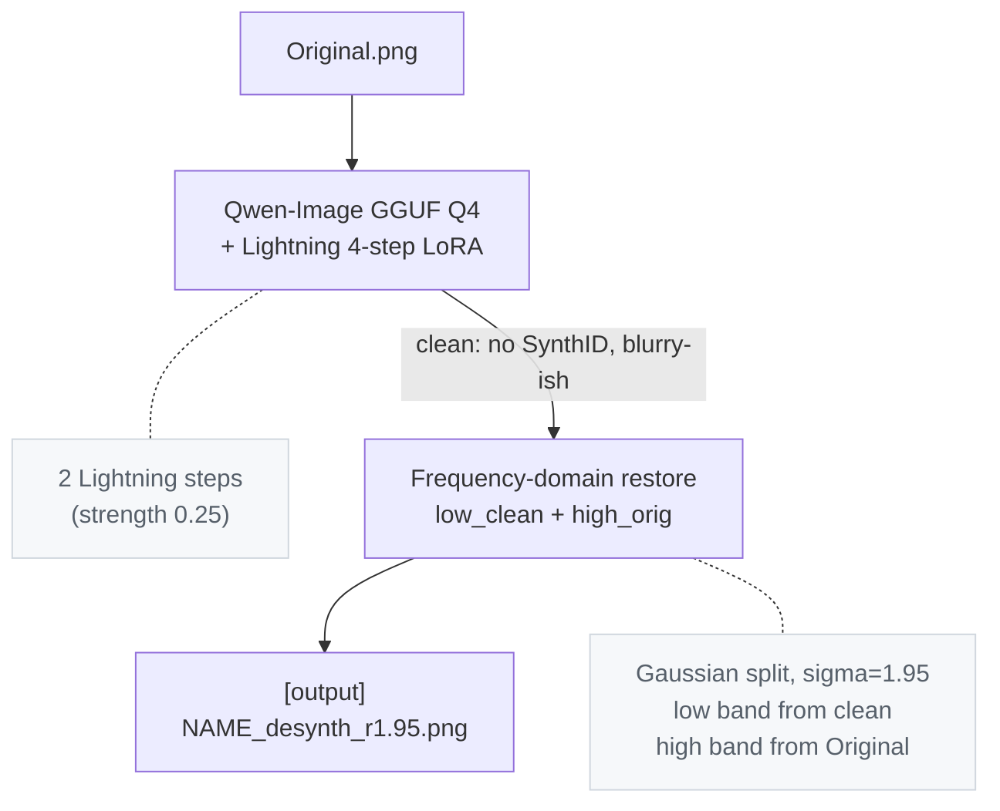

# Desynth

A tool & pipeline for removing OpenAI & Google's SynthID watermark from images.  
This project is intended solely for research, education, and authorized evaluation.

## Simple web UI (Docker Compose)

Upload one image, choose **Process image**, compare original and processed images,
then **Download PNG**. DeSynth lightly regenerates the image and restores detail
from the original. Completion and visual similarity are **not proof of watermark
removal**; this UI has no watermark detector. The historical results below are
upstream claims, not verification of this web integration.

### Setup on the GPU host

Requires Docker Engine with Docker Compose v2+ and NVIDIA Container Toolkit
configured for Docker, plus a compatible NVIDIA driver (the image uses PyTorch
2.7.1 / CUDA 12.8). Allow ample disk space for the image, models and HF cache.
The upstream hardware reference is an 8 GB NVIDIA GPU with sequential CPU
offload and 32 GB system RAM; this integration has not been GPU-tested.

From the repository directory on your GPU host:

```bash
mkdir -p models data/cache data/output
docker compose build
docker compose up -d
curl http://127.0.0.1:7860/health
```

Open **http://127.0.0.1:7860** on that host. The UI starts even without models;
it does not load or download weights at startup or during health checks.
`/health` reports service liveness, missing prerequisites, and whether a model
has been loaded. HTTP 200 is not a GPU/inference-readiness guarantee. Actual CUDA
availability is checked when you press Process.

Download these files yourself from their publishers into the mounted `models/`
directory (no automatic transformer/LoRA download):

| Host path | Container path | Source |
| --- | --- | --- |
| `models/qwen-image-2512-Q4_K_M.gguf` | `/models/qwen-image-2512-Q4_K_M.gguf` | [Frederic75/Qwen-Image-2512-GGUF](https://huggingface.co/Frederic75/Qwen-Image-2512-GGUF), about 13 GB |
| `models/Qwen-Image-2512-Lightning-4steps-V1.0-fp32.safetensors` | `/models/Qwen-Image-2512-Lightning-4steps-V1.0-fp32.safetensors` | [lightx2v/Qwen-Image-2512-Lightning](https://huggingface.co/lightx2v/Qwen-Image-2512-Lightning), about 1.6 GB |

`embeds_cache.pt` is already supplied by this repository and copied into the
image at `/app/embeds_cache.pt`; do not replace it with untrusted files.
The **first Process request** also fetches the VAE (upstream estimate ~250 MB)
and pipeline/transformer/scheduler configuration from
[Qwen/Qwen-Image](https://huggingface.co/Qwen/Qwen-Image) if absent from cache.
It needs Hugging Face network access on that first run. Later requests reuse
the loaded pipeline and the persistent `data/cache` HF cache (`/data/cache`).
The initial model load may take a while. Errors are displayed on the page;
inspect `docker compose logs --tail=100 desynth` for the underlying failure.

Each completed request stores `original.png` and `output.png` in a unique
`data/output/<id>/` directory (`/data/output/<id>/` in the container). These
survive restarts; previews/download links remain valid while files are retained.
There is no gallery or automatic retention policy. Delete unneeded result
directories manually when the service is stopped. The model mount is read-only.

### Remote access, port and lifecycle

The host port is bound to **127.0.0.1 only** by default, not the LAN or internet.
For Nexus, run this tunnel on your own computer:

```bash
ssh -N -L 7860:127.0.0.1:7860 x@10.10.10.45
```

Then open **http://127.0.0.1:7860** on your computer. If needed, add your usual
SSH identity option (`-i /path/to/key`). To use a different host port:

```bash
DESYNTH_PORT=7870 docker compose up -d
# Corresponding tunnel on your computer:
ssh -N -L 7870:127.0.0.1:7870 x@10.10.10.45
```

The optional `DESYNTH_BIND_ADDRESS` setting can explicitly bind a trusted LAN
address instead of loopback, but this service has **no accounts or authentication**.
Prefer the SSH tunnel; do not expose it publicly. Compose is standalone: no
image-api network, ports, volumes, dependencies or services are reused.

```bash
docker compose ps
docker compose logs --tail=100 desynth
docker compose stop       # stop; retain container and persistent files
docker compose down       # remove this Compose service/network; retain bind-mounted files
```

The primary action uses upstream defaults: random seed, denoise 0.25, 8 steps,
one pass, Gaussian restoration with sigma 1.95, sharpening off. The collapsed
Advanced settings section exposes seed, denoise, steps, restoration mode/sigma
and sharpening. Only one image is processed at a time; another request receives
a busy message. Keep the page open until completion. Closing it does not cancel
inference. Run only one service replica / Gunicorn worker so its GPU lock is shared.

### Focused offline verification

No GPU, PyTorch or model downloads are needed for the focused tests:

```bash
python3 -m venv .venv-web
.venv-web/bin/pip install -r requirements-test.txt
.venv-web/bin/python -m pytest -q tests
docker compose config --quiet
```

The real HTTP test client exercises upload → settings/pixels → one-pass
orchestration → real frequency restoration → saved PNGs → previews/download,
including persisted download after app recreation. **Test-only fakes replace
model loading and expensive sampling**, not the application/restoration path.
Additional checks cover lazy health, setup errors, busy/error states, CLI help,
and the page's form/JavaScript wiring. These are not browser execution, GPU
inference, or watermark-effectiveness tests. PR CI runs only these small tests
and Compose validation, without large weights or inference dependencies.

For a CPU-only startup smoke of the actual image, without claiming GPU proof:

```bash
docker build -t desynth-ui .
docker run --rm -p 127.0.0.1:17860:7860 desynth-ui
```

The normal Compose service requests a GPU; this standalone smoke does not.
Visit `/` and `/health` only; do not submit an image. Stop the temporary container with Ctrl-C. Startup
does not run inference; NVIDIA access is required for actual processing.

The CLI below remains available separately. `requirements.txt` retains the
pipeline dependencies; unused `llama-cpp-python` was removed and OpenCV uses its
headless package for container compatibility. PEFT is included for the existing
Lightning LoRA loader. The web image adds Flask/Gunicorn.

## Results
Edge Mode:

Gaussian Mode (Default):


## Metrics
All scores are input image vs output via the included `compare.py`.

### Against other research (Gemini/Google, 2752×1536)

| metric                 | our method | [competitor](https://github.com/00quebec/Synthid-Bypass) |
|------------------------|--------------:|-----------------:|
| PSNR                   |  **28.75 dB** |  20.21 dB        |
| SSIM                   |     **0.946** |     0.624        |
| SSIM (low-frequency)   |     **0.944** |     0.812        |
| SSIM (high-frequency)  |     **0.987** |     0.641        |
| MAE (lower is better)  |      **5.33** |    12.18         |
| Output resolution      |   2752×1536   |    1501×835      |
| SynthID verdict        |   not found   |    not found     |


### Our own test image (GPT Image 2.0/OpenAI, 1460×1078)

| metric                 | gaussian (default) | edge mode |
|------------------------|--------------:|--------------:|
| PSNR                   |  **32.47 dB** |   31.47 dB    |
| SSIM                   |     **0.956** |     0.948     |
| SSIM (low-frequency)   |     **0.959** |     0.955     |
| SSIM (high-frequency)  |     **0.991** |     0.984     |
| MAE                    |      **3.82** |     4.08      |
| SynthID verdict        |   not found   |   not found   |

* Edge mode trades a small amount of measurable detail for better perceptual
shape continuity at contours.


## How it works



## Usage

Download the two model files into the repo root:

| file                                                      | size   | source |
|-----------------------------------------------------------|--------|--------|
| `qwen-image-2512-Q4_K_M.gguf`                             | ~13 GB | [Frederic75/Qwen-Image-2512-GGUF](https://huggingface.co/Frederic75/Qwen-Image-2512-GGUF) |
| `Qwen-Image-2512-Lightning-4steps-V1.0-fp32.safetensors`  | ~1.6 GB | [lightx2v/Qwen-Image-2512-Lightning](https://huggingface.co/lightx2v/Qwen-Image-2512-Lightning) |


### Run

```powershell
python desynth.py                          # processes original.png
python desynth.py path\to\image.png        # processes any input
```

Output: `out/<name>_desynth_s8_d0.250_p1_r1.95.png`. Random seed per run by
default. First run downloads ~250 MB of VAE + configs from Hugging Face
and caches them.

### Flags

| flag                  | default | when to use |
|-----------------------|---------|-------------|
| `--seed N`            | random  | reproducible runs |
| `--denoise X [X X]`   | 0.25    | sweep denoise |
| `--steps N`           | 8       | per-pass step count |
| `--passes N`          | 1       | iterate img2img |
| `--restore-sigma X`   | 1.95    | tune detail restore |
| `--restore-mode M`    | gaussian | `edge` for shape-coherent contours |
| `--unsharp X`         | 0.0     | post-restore sharpen; 0.2 is the perceptual sweet spot |
| `--no-restore`        | off     | skip the frequency restore step |
| `--keep-intermediate` | off     | save the pre-restore clean output |
| `--transformer PATH`  | Q4_K_M  | try a different GGUF quant |

### Quality check

```powershell
python compare.py Original.png out\<output>.png
```

Prints PSNR, SSIM (full + low/high band), MAE, MSE, and per-channel
histogram correlation.

## Files

| file                                                      | role                                                       |
|-----------------------------------------------------------|------------------------------------------------------------|
| `desynth.py`                                              | main pipeline: img2img + restore in one call               |
| `compare.py`                                              | similarity metrics between two images                      |
| `embeds_cache.pt`                                         | cached prompt embeddings (~430 KB)            |
| `qwen-image-2512-Q4_K_M.gguf`                             | Qwen-Image transformer, GGUF Q4 quant (~13 GB)             |
| `Qwen-Image-2512-Lightning-4steps-V1.0-fp32.safetensors`  | 4-step Lightning distillation LoRA (~1.6 GB)               |

## Hardware Requirements

Tested on Windows 10, RTX 5060 Ti 8 GB, 32 GB DDR4 RAM.
Sequential CPU offload is required with < 12GB VRAM

## Known limitations

- Lightning's 4-step distillation is the source of most of the residual
  drift.  
  (Dropping it for proper 20+ step sampling would likely tighten metrics further at the cost of 5x longer
  runs.)

## Credits

Baseline workflow and watermark hypothesis from
[00quebec/Synthid-Bypass](https://github.com/00quebec/Synthid-Bypass).  
This pipeline reimplements the core idea in plain Python without ComfyUI,
ControlNet, or the face-detail path, and replaces the heavier redraw with a
two-step minimum denoise + frequency-domain restore.
